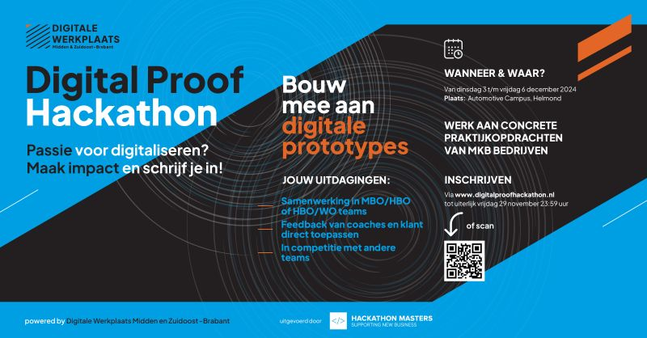
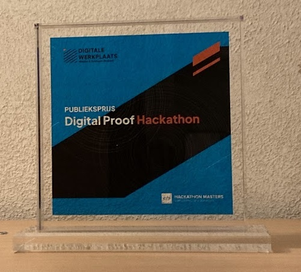
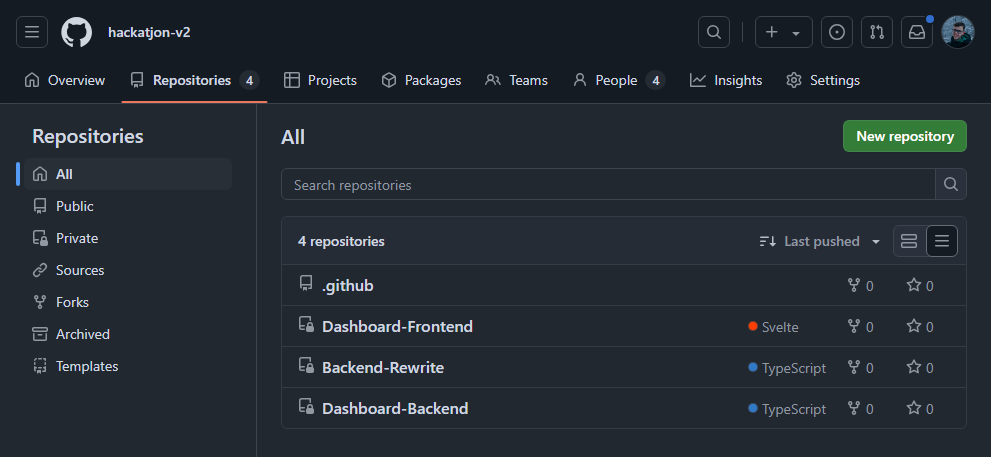

# Hackatjon-v2

This organization was created to participate in the Digital Proof Hackathon of December 2024 at the Automotive Campus in Helmond, The Netherlands.

## We won the audience award:

We chose challenge B: we had to create a realtime SPA dashboard using a dataset we received with around 70 columns of information. We were told that all of these variables were relevant: we had to squeeze all of those values onto the dashboard somehow. The frontend was written in Svelte+TS, using Axios to talk to the backend. The backend was Typescript and Express.JS, with an SQL database to store the data we received.

For privacy reasons I've decided to leave out any specifics about the data, the company or the assignment we were given. I'm not looking for legal trouble any time soon, better safe than sorry. This is also why the source code of the application isn't available to the public. Still, I would like to show at least _something_, so the best I can do is this screenshot of the repositories in this organization:

## Credits

This edition of the Digital Proof Hackathon was made possible by [De Digitale Werkplaats](https://www.mijnbedrijfdigitaliseren.nl/), [Hackathon Masters](https://hackathonmasters.com/), [Automotive Campus Helmond](https://www.automotivecampus.com/) and [Innovatiehuis de Peel](https://innovatiehuisdepeel.nl/default.aspx).

Hackatjon-v2 consisted of me and these amazing people:

[@luvbxgs](https://github.com/Luvbxgs), [@zyggzzz](https://github.com/zyggzzz) and [@TiesOnKip](https://github.com/TiesOnKip).

You guys are truly amazing. Thank you everyone!

---

This organization has been archived as a result of the ending of this Hackathon event.

